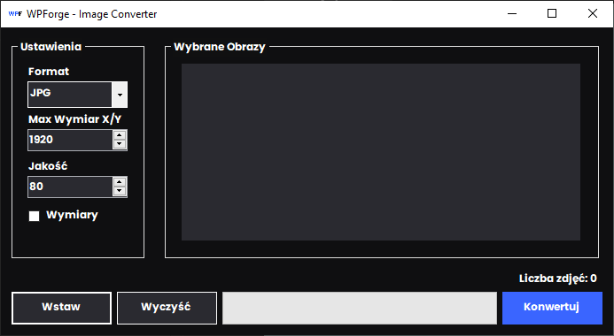
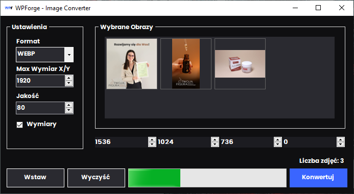
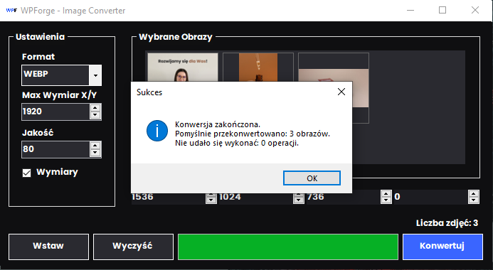
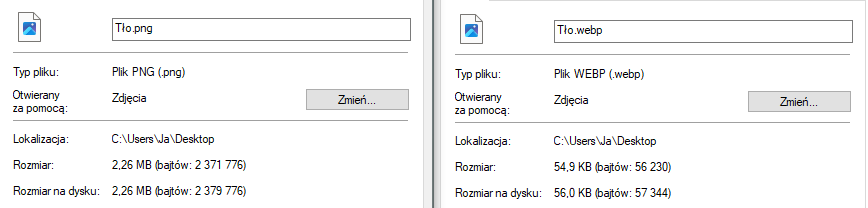

# Image Converter

Prosty konwerter obrazów w Windows Forms (C#) pozwala na:
- zmianę formatu (JPG, PNG, BMP, WEBP)
- skalowanie proporcjonalne do zadanego wymiaru
- definiowanie czterech dodatkowych rozdzielczości
- podgląd miniaturek i drag-&-drop plików
- wywołanie komunikatów o błędach

## Funkcje

- Dodawanie wielu plików jednocześnie (OpenFileDialog lub drag-&-drop).  
- Panel miniaturek z możliwością usuwania pojedynczo.  
- Główny wymiar + dodatkowe niestandardowe wymiary (do 4 wartości).  
- JPG i WebP (z regulowaną jakością), PNG, BMP (Magick.NET).
- Pasek postępu informujący o stanie konwersji.  

## Screenshots

1. **`Zbudowany plik.exe`**  
  

2. **`Wygląd programu`**  
  

3. **`Działanie programu`**  
  
  

4. **`Wynik programu`**  
  

5. **`PNG 2,26MB`**  

5. **`WEBP 54,9KB`**  

